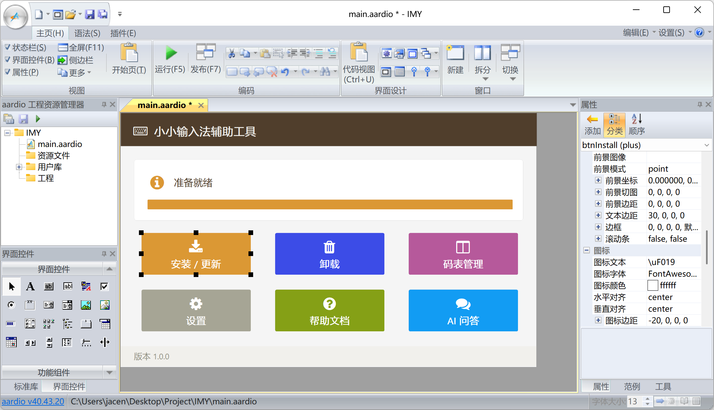

# IMY 小小输入法辅助工具
 

请在 [aardio](https://www.aardio.com) 中打开工程，按<kbd>F5</kbd>运行程序（会安装缺少的 key.ime.yong 扩展库 ）。 按<kbd>F7</kbd> 可发布为独立 EXE 文件。

如果使用 [ImTip](https://imtip.aardio.com)，遇到小小输入法的输入状态显示不正确的问题， 可以使用此工具卸载然后重新安装[小小输入法](https://yong.dgod.net)就可以了。

本项目主要包含图形界面的源代码，调用小小输入法接口的源代码在 key.ime.yong 扩展库内。